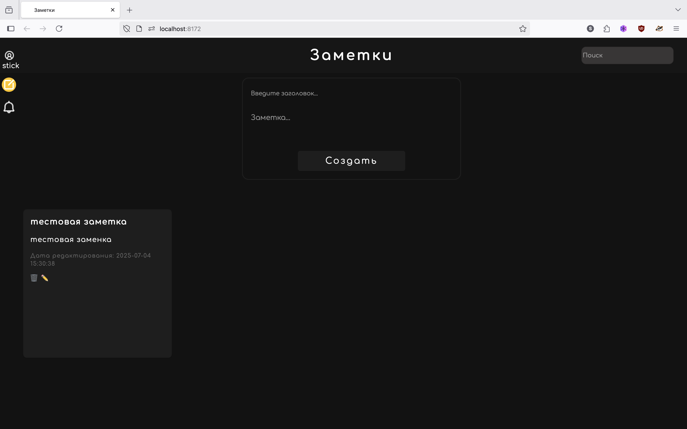
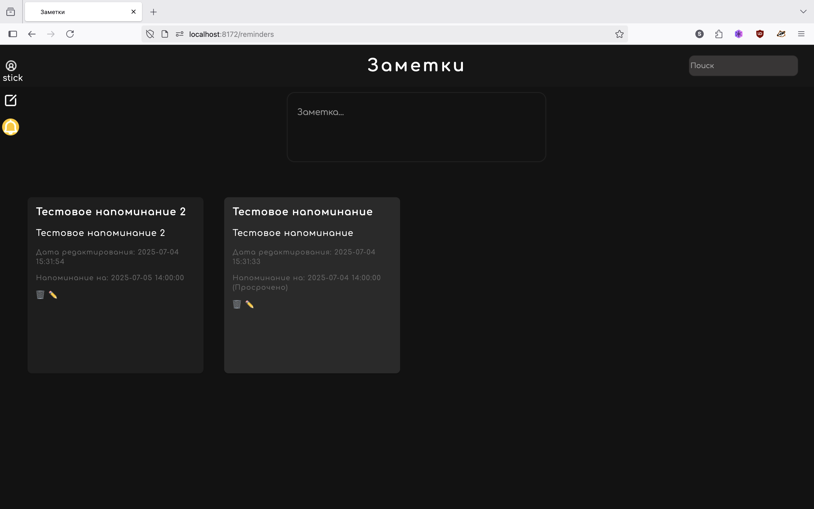
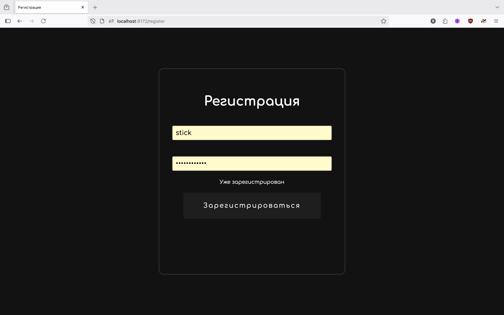

# Notes-App

Welcome to **Notes-App**!

This project helps you manage and organize your notes in an intuitive and scalable way. It leverages Docker for easy setup and includes a migration script to configure your environment.

---

## 📸 Project Screenshot

Below are some screenshots of the application, located in the `www/assets/screenshot/` directory.

| Main Screen                   | Reminder screen               | Registration                  |
|-------------------------------|-------------------------------|-------------------------------|
|  |  |  |

## 🚀 Installation & Setup

Follow these commands to set up the project locally:

```bash
# Clone the repository
git clone https://github.com/stick231/notes-app.git

# Open project
cd notes-app

# Copy environment variables example to .env
mv .env.example .env 

# Build and run the containers in detached mode
docker-compose up --build -d 

# Run the migration script inside the container
docker exec -it <container_name_or_id> php /var/www/migration.php
# If use default settings run this command
docker exec -it web php /var/www/migration.php
```

---

## 📝 Environment Variables

- You must create a `.env` file based on `.env.example` and update it with your actual configuration.

---

## 💡 Contributing

Feel free to fork the repo and submit pull requests!

---

## 📄 License

This project is licensed under the [MIT License](LICENSE).

---

**Happy note‑taking!**
